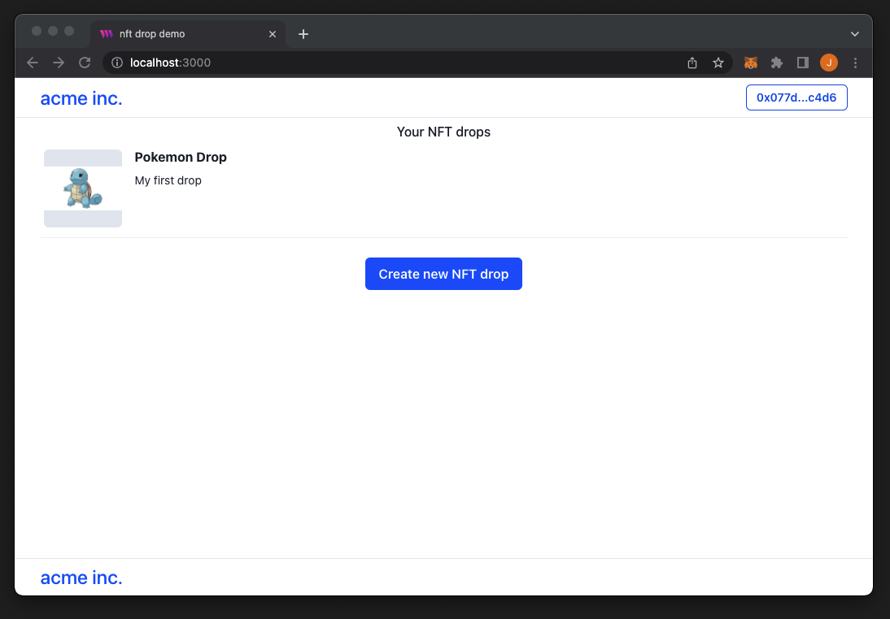
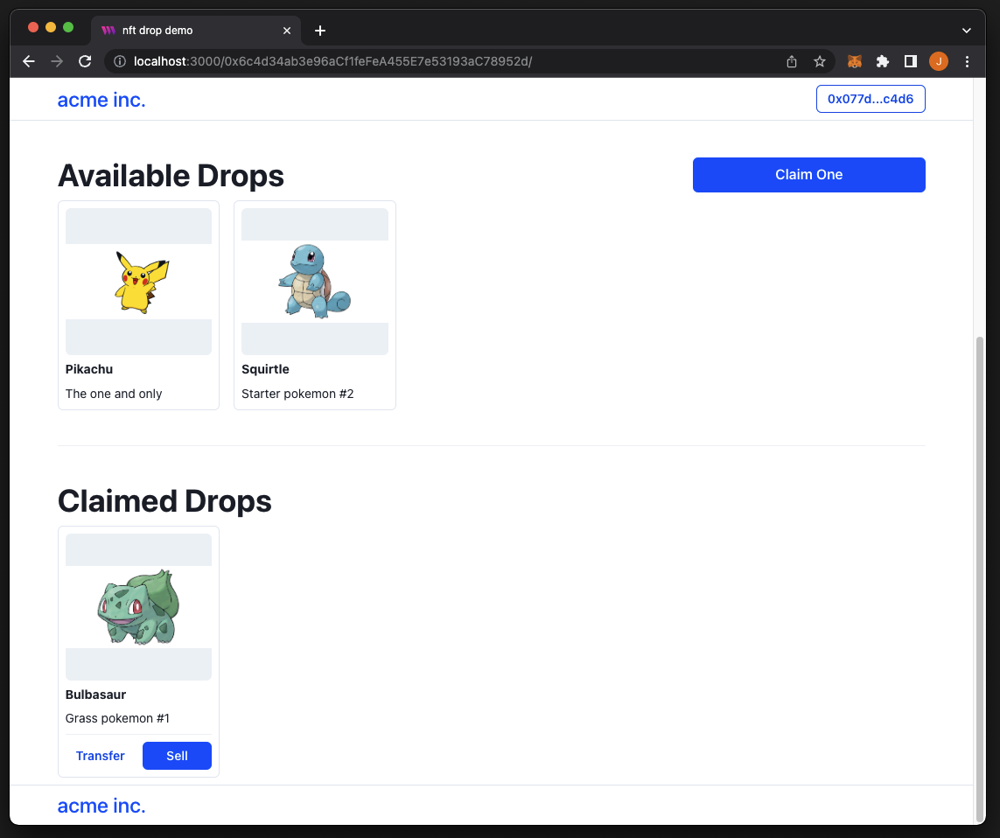

# Deploy and launch your own NFT Drop

This project demonstrates how to deploy and use [NFT Drop](https://portal.thirdweb.com/contracts/nft-drop) contract in thirdweb using hooks from the [thirdweb React SDK](https://docs.thirdweb.com/react).

The NFT Drop contract gives you a distribution mechanism for your 1-of-1 NFTs.

**Check out the Demo here**: [https://nft-drop-vite-ts.vercel.app/](https://nft-drop-vite-ts.vercel.app/)


## Tools

- [thirdweb React SDK](https://docs.thirdweb.com/react): A collection of hooks to connect a user’s wallet, access contracts and interact with them.
- [thirdweb TypeScript SDK](https://docs.thirdweb.com/typescript): A powerful web3 SDK to deploy and interact with smart contracts.
- [ViteJS](https://vitejs.dev/): A lightweight react framework. This demo works the same with any other web framework.

---

## Run this example

### Code sandbox

You can browse and edit the code directly in this [Code sandbox](https://codesandbox.io/s/github/thirdweb-example/nft-drop-vite-ts?file=/src/App.tsx).

### Local setup

- Install the required dependencies:

```
npm install
# or
yarn install
```

- Run the development server:

```
npm run dev
# or
yarn dev
```

- Visit [http://localhost:3000/](http://localhost:3000/) to see the result.

# Guide

## Setting Up ThirdwebProvider

In `src/index.tsx` we are wrapping our application with the [ThirdwebProvider](https://docs.thirdweb.com/react) component, which allows us to configure the Network we want our user's to be on. This is necessary for our other hooks in our application to share the same context.

```jsx
// This is the chainId your dApp will work on.
export const activeChainId = ChainId.Polygon;

<ThirdwebProvider desiredChainId={activeChainId}>
  <BrowserRouter>
    <Routes>...</Routes>
  </BrowserRouter>
</ThirdwebProvider>;
```

## Connecting the user’s wallet

In `components/header.tsx` we use `useCoinbaseWallet()` hook to access the Coinbase Wallet connect function and wire it to a “Connect Wallet” button in our UI. On button click, the button will promptthe user to connect their Coinbase Wallet to our application. We support many other ways to connect a user's wallet, for more information check out the [documentation](https://docs.thirdweb.com/react/category/wallet-connection).

```jsx
const connectCoinbaseWallet = useCoinbaseWallet();

<Button onClick={() => connectCoinbaseWallet()}>Connect Wallet</Button>;
```

## Deploying a Drop contract

In `pages/create-drop.tsx` we are using the `useSDK()` hook to access the [Typescript thirdweb SDK](https://github.com/thirdweb-dev/typescript-sdk), already setup with the user’s wallet.

Deploying contracts with the thirdweb SDK is simple, in this page we collect the contract metadata (name, description, image) and pass it to `deployNFTDrop` to deploy the contract on behalf of the connected user. **The connected wallet is the owner of the deployed contract, and has full control over it.**

```jsx
await sdk.deployer.deployNFTDrop(contractMetadata);
```

Once deployed, we can display back the list of contracts deployed by the user by querying the users’ contract list from the SDK, like shown in `pages/home.tsx`

```jsx
await sdk.getContractList(address);
```



## Setting up the Drop

`pages/drop.tsx` and `pages/mint-nft.tsx` are the main pages that handles setting up the actual drop.

Accessing a contract with the thirdweb react SDK is done using the corresponding hook. Here’s how to access the Drop contract from its address:

```jsx
const drop = useNFTDrop(dropContractAddress);
```

From there, we can use all the functions in our contract. Let’s start by setting a price for our drop, this is done by setting a claim condition on our contract. For an example, to set a price of `1 ether` per NFT claim, you could do so by:

```jsx
await drop.claimConditions.set([{ price: 1.0 }]
```

Claim conditions offer many options to control your NFT Drop claiming mechanics:

- Price
- Currency (native or any ERC20 token)
- Allow lists (list of addresses authorized to mint + max claimable quantity per address)
- Maximum number of claims per transaction
- Maximum of claimable NFTs
- Start and end time

Learn more about claim conditions in the [documentation](https://docs.thirdweb.com/typescript/sdk.dropclaimconditions.set). You can also set these on the [thirdweb dashboard](https://thirdweb.com/dashboard) for your Drop contract.

In `pages/mint-nft.tsx` we setup the UI to mint a new NFT in our drop contract. The UI let’s a user input the NFT metadata, which we can then mint using the SDK

```jsx
await drop.createBatch([
  {
    name: "Pikachu",
    description: "The one and only",
  },
  {
    name: "Squirtle",
    description: "Starter pokemon #2",
  },
]);
```

In this example we’re only creating one NFT at a time, but the power of Drop contracts comes from being able to “lazy mint” hundreds or thousands of NFTs in one transaction, reducing transaction fees.

## Listing claimed and unclaimed NFTs

In `pages/drop.tsx` we list all the minted NFTs in two sections, claimed and unclaimed NFTs.

```jsx
await drop.getAllUnclaimed(); // list of NFT
await drop.getAllClaimed(); // list of NFT + owner
```

This returns an array of NFT metadata and their owner if the NFT has been claimed. This allows to show different actions for claimed vs unclaimed NFTs.



## Claiming the NFTs

In `components/NftDropItem.tsx`, we add a claim button to let users claim the unclaimed NFTs. Claiming an NFT in a Drop contract assigns the next unclaimed NFT to the claimer.

```jsx
// Claiming the NFT in the order of when the NFTs are lazy minted
await drop.claim(1);
```

The claim function takes care of transferring the price tokens to the contract. For example, if the drop claim condition’s price is set to be `1 ether` per NFT claim, the claim function would automatically transfer the required amount and execute the claim.

---

## Join our Discord!

For any questions, suggestions, join our discord at [https://discord.gg/thirdweb](https://discord.gg/thirdweb).
